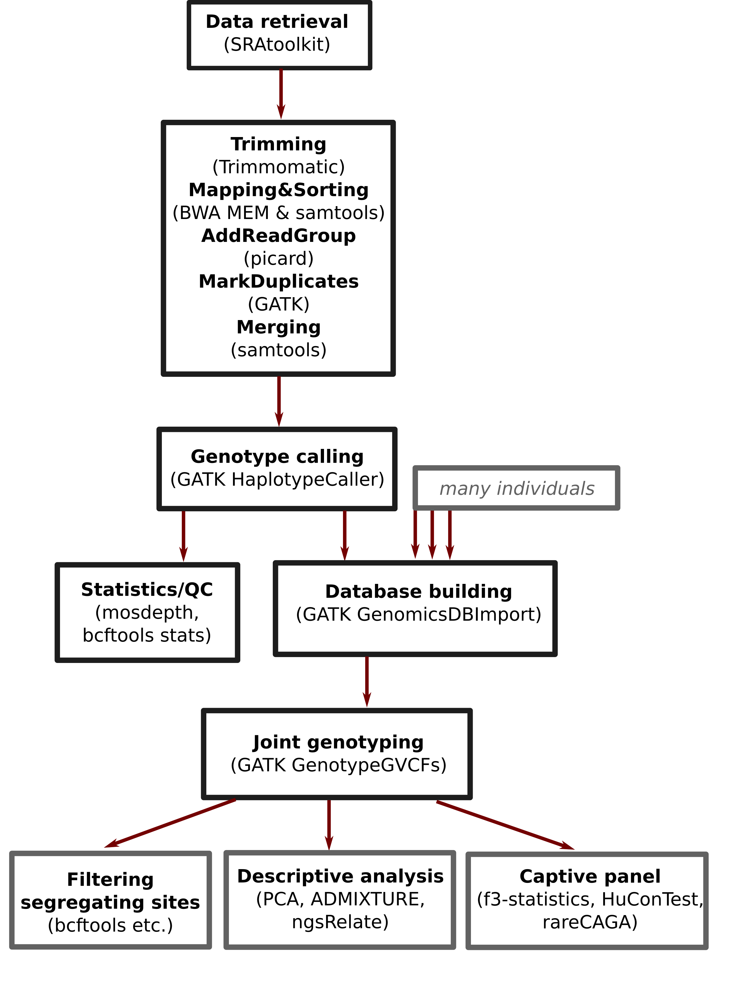

# Great_Ape_genomes

Code associated to the data curation project of great ape high-coverage genomes. We report an assembled dataset of 206 whole great ape genomes from multiple studies, with mappings in `CRAM` format and genotypes in `VCF` format. The data is published [here through the University of Vienna PHAIDRA repository](https://phaidra.univie.ac.at/o:2066302).

Note that this is a not a software package, but a documentation of the procedures. This code depends on software configurations and environments as well as reference genomes that are publicly available but not provided as part of this documentation. Scripts are slurm or `R` scripts with parameters adjusted to the VSC4 in Vienna.

## Metadata
The table with the metadata on individuals is here: `files/metadata.txt`.

### The pipeline of the project




### 1) Basic processing (from SRA to CRAM)

This file was used for the basic processing per individual:

```
processing/basic_processing.sh
```

It contains the steps from downloading the raw data and QC, through adapter trimming, mapping, adding RG and markduplicates, to merging to final `CRAM` file. There are control points to ensure success. Mapping is done to the human genome version hg38.

It needs a selection of the SRA IDs of a given individual and creating a directory with the individual name. Running the script in the directory will do the whole job.

The goal here is to obtain a `CRAM` file with the mapped sequences in `./mapping/merge/` with the name convention `$ind.merge.cram`. This file is uploaded to the data repository of this project.


### 2) Genotype calling (from CRAM to VCF)
  
Then, genotype calling is performed with GATK4. To this end, you should simply do:
  
```
processing/gtcallingall.sh
```

This is a slurm script run in the same directory, as one job that will take one node to run all chromosomes in parallel.

The goal here is to obtain the genotype calls in genome VCF format in `./snpcalling/` with the name convention for the chromosomes (chr) `$ind_$chr.g.vcf.gz`. These files are uploaded to the data repository of this project.

If everything went fine, and after inspecting the quality checks in the next section, things were tidied up with:

```
analysis/tidying.R
```


### 3) Quality checks

Once this was done, we performed a quality check with three programs: `mosdepth`, `samtools stats` and `bcftools stats`, as shown in:

```
analysis/g_stats.sh
```

We ran this slurm script in the same individual directory.

It generated in `./mapping/merge/` a report for `mosdepth` and `samtools stats` on the cram file, and in `./snpcalling/` a report for `bcftools stats` per chromosome.

Next, we wanted to check that the VCFs have a proper ending position. This slurm script prints the last line of each chromosome `VCF` into a file in `./snpcalling/`:

```
analysis/cvrg.sh
```

Then, there is an R script to then summarize all these stats:

```
analysis/coverage_stats.R
```

It reads in the results, and creates tables as well as plots. A distinct directory was used to store the summary stats, to plots and tables. In another script, the coverage distribution across the genome and separately for chrX is obtained, as well as the central 98% of the coverage for each individual. This can be used for downstream filtering.

```
analysis/central_coverage.R
```

### 4) Genotype merging/joint calling (from single to multi VCF)

Genotype merging requires building a database of the genomes, and then joint calling of SNPs across individuals.

The process is documented in two scripts for database creation joint calling:

```
processing/importDB1.sh
processing/importDB2.sh
```

The procedure is done for the three species complexes separately (Pan, Gorilla, Pongo). Files  are found here: `ImportDB/${species}/`.


### 5) Ancestral allele (using the macaque allele from rheMac10)

We can use the macaque reference allele as ancestral state, which is relevant for some of the downstream analyses. In order to do this, hg38 coordinates for all segregating sites were obtained, the rheMac10 allele (in the right orientation) added, and bed files created. The process is documented in an `R` script for preparation and a slurm script for submission:

```
processing/create_ancestral.R
processing/create_anc.sh
``` 


### 6) Filtering

All genotype calls are reported, but for some analyses, filtering is useful. We report a basic filtering: genotypes within the central 98% of the coverage distribution are retained, genotyes with high allele imbalance (less than 15% for the minor allele) are removed, and a mappability score (kmer size of 36 bp) is added.

In a first step, all positions are kept, only the genotypes removed, with files named as `chr$chrom.filteranno.vcf.gz`.

In a second step, a "clean" filtered dataset is provided, with only bi-allelic SNPs passing all filters in all individuals and mappability scores of 1, in files named as `chr$chrom.clean.filtered.vcf.gz`.

```
processing/filtering.sh
``` 


### 7) Conversion to plink

A conversion of genotypes into `plink2` format is shown necessary for some analyses, e.g. to create a PCA, as well as other downstream analyses that require this format.

```
processing/vcf2plink.sh
```

### 8) Analysis of all individuals and specifically the captive panel

Some analyses wer performed on the whole panel, while a specific analysis of the captive individuals was performed to characterise these individuals. Specifically, this contains the calculation of f3-statistics with the reference panel for each subspecies, in order to assign the correct subspecies to each captive individual. Human contamination is tested using the `HuConTest` script.

Many things are within an `R` script, which is called for some tasks by a slurm script for basic analyses:

```
analysis/basic_analysis.R
analysis/bas_ana.sh
```

Here, we calculate f3-statistics, measure human contamination and perform geolocalization for chimpanzees. This geolocalization is performed using `rareCAGA`. Since the target SNPs for `rareCAGA` are based on hg19, a liftover of genotypes on chromosome 21 was necessary. Furthermore, runs of homozygosity are estimated with `bcftools roh`.

Relatedness was estimated with the `ngsRelate` method:

```
analysis/ngsRelate.sh
```

PCA [tbd]

ADMIXTURE [tbd]


## Figures

Figures for the paper were prepared in `R` except Figure 1 (overview), which was done using `InkScape`.

```
analysis/figures.R
```

Figure 2: Coverage and heterozygosity.

Figure 3: PCA and population clustering. [tbd]

Figure 4: Kinship and ROHs. [tbd]

Figure 5: Summary of captive panel results.

